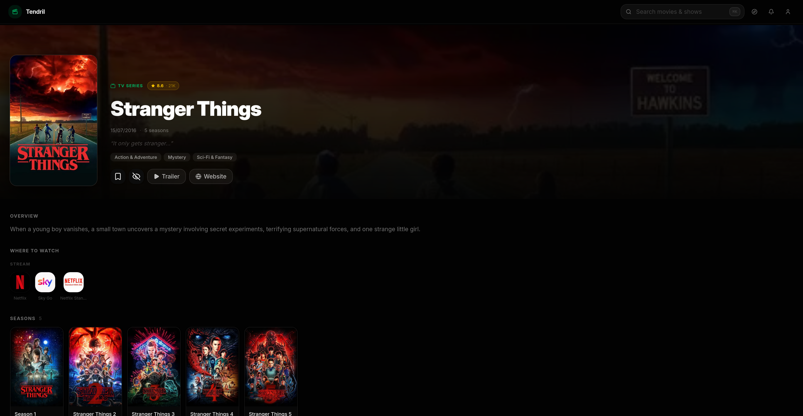
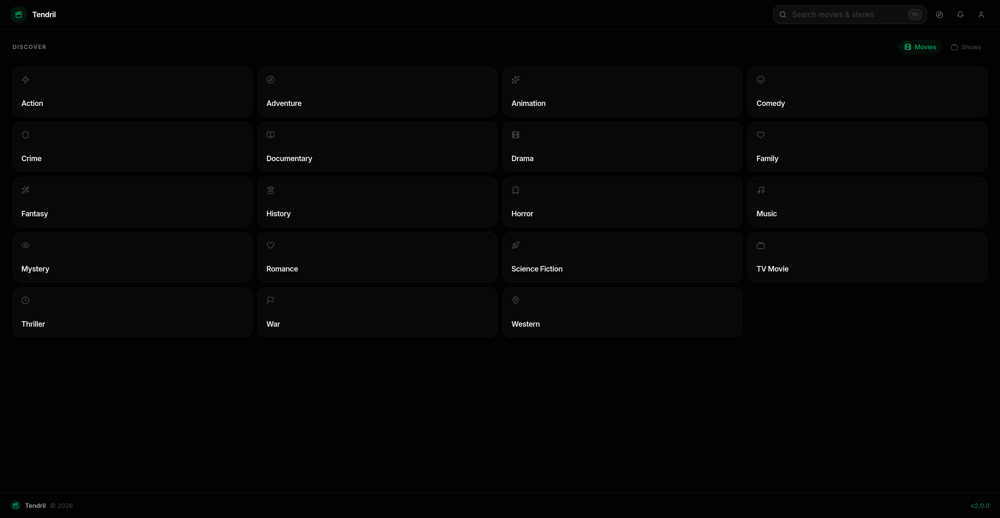
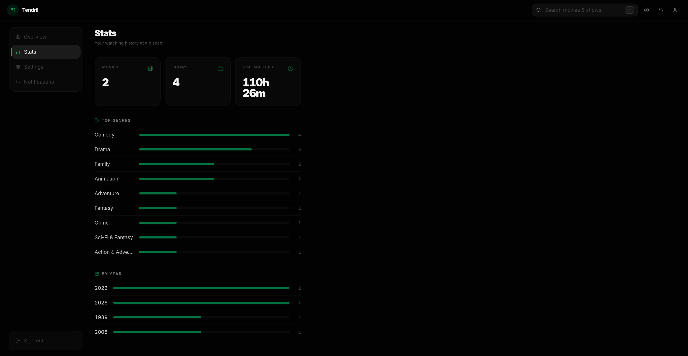

<h1>Tendril</h1>

  <code>/ˈtɛn.drɪl/</code> &nbsp;·&nbsp; <i>TEN-dril</i>. The slender shoot a climbing plant sends out to reach, 
  find, and latch onto support, just as the app reaches out to track what's worth holding onto.

  <b>A self-hosted media tracker for movies &amp; TV shows.</b> 
  Search, explore recommendations, browse categories, track upcoming releases, 
  and stay on top of what you're watching.

  
  
  
  
  
  
  
  

---

### ✨ Features

- **Find something to watch.** A hero carousel puts trending and featured titles front and centre. Browse trending, popular, top rated, new, and upcoming titles for both movies and TV shows, or just search for the one you already have in mind.
- **Dig into the details.** Every title gets its own page with the trailer, cast and crew, the studios and networks behind it, and a "More Like This" rail for when one good film turns into a whole evening.
- **Keep track of what you've seen.** Mark things watched, and for shows it goes season by season and episode by episode, so "Continue Watching" actually knows where you left off.
- **Make it yours.** Build your own lists and organize titles however makes sense to you.
- **See your habits.** Stats add up how many movies and shows you've finished and how many hours you've poured into them. (No judgement.)
- **Can't decide?** Hit **Surprise me** and let it pick for you.
- **Get a nudge.** Opt into push notifications and Tendril will tell you when something you're tracking lands, or when a new entry shows up in a collection you follow.
- **No passwords.** Sign in with a passkey. Nothing to remember, nothing to leak.
- **Set it up your way.** Region, language, timezone, original vs. localized titles, and whether to include adult content are all yours to configure.
- **Install it like an app.** It's a PWA, so it lives on your home screen and works like a native app.
- **Yours, on your box.** Fully self-hosted. One `docker compose up` and it's running on your own server.

### 📸 Screenshots

<table>
  <tr>
    <td colspan="2"></td>
  </tr>
  <tr>
    <td width="50%"></td>
    <td width="50%"></td>
  </tr>
  <tr>
    <td width="50%"></td>
    <td width="50%"></td>
  </tr>
  <tr>
    <td width="50%"></td>
    <td width="50%"></td>
  </tr>
</table>

### ⚙️ Environment Variables

| Name              | Notes                                                                                                                            |
|-------------------|----------------------------------------------------------------------------------------------------------------------------------|
| ACCESS_TOKEN      | API token for The Movie Database                                                                                                 |
| POSTGRES_HOST     | Default to `postgres`, the host for the postgres database                                                                        |
| POSTGRES_PORT     | Default to `5432`, the port for the postgres database                                                                            |
| POSTGRES_USER     | Default to `admin`, the username for the postgres database                                                                       |
| POSTGRES_PASSWORD | Password for the postgres database user                                                                                          |
| POSTGRES_DB       | Default to `tendril`, the name for the postgres database                                                                         |

### 🐳 Install with Docker
Remember to set the environment variables you wish in the .env file. ( minimum `ACCESS_TOKEN` and `POSTGRES_PASSWORD` )   
To start the containers run:

~~~ 
docker-compose up -d 
~~~ 

Then go to: http://localhost:3002